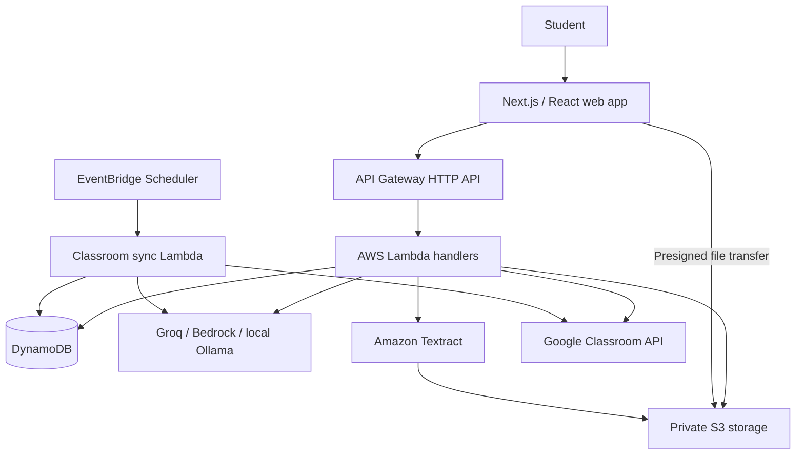

# ORA

**An academic planning web app that brings classes, deadlines, notices, and study sessions into one place.**

Ora helps students turn scattered academic updates into actionable tasks and a daily study plan. It combines Google Classroom synchronization, AI-assisted notice extraction, timetable management, and focus tracking to keep academic work organized as deadlines change.

The current web interface is branded **Ora**; the repository and backend use the name **Ora**.

## Contents

- [ORA](#ora)
  - [Contents](#contents)
  - [Tech stack](#tech-stack)
    - [AI configuration](#ai-configuration)
  - [Functionality](#functionality)
    - [Academic dashboard](#academic-dashboard)
    - [Task management](#task-management)
    - [Notice processing and review](#notice-processing-and-review)
    - [Google Classroom integration](#google-classroom-integration)
    - [Timetable and study planner](#timetable-and-study-planner)
    - [Focus sessions](#focus-sessions)
    - [Main screens](#main-screens)
  - [Screenshots](#screenshots)
    - [Dashboard](#dashboard)
    - [Tasks and task details](#tasks-and-task-details)
    - [Study planner](#study-planner)
    - [Add \& Setup](#add--setup)
  - [Architecture](#architecture)
  - [Getting started](#getting-started)
    - [Prerequisites](#prerequisites)
    - [1. Install dependencies](#1-install-dependencies)
    - [2. Configure the frontend](#2-configure-the-frontend)
    - [3. Start the frontend](#3-start-the-frontend)
    - [4. Run the backend locally (optional)](#4-run-the-backend-locally-optional)
    - [Local AI with Ollama](#local-ai-with-ollama)
  - [Configuration](#configuration)
  - [Checks and scripts](#checks-and-scripts)
  - [Deployment](#deployment)
  - [Project structure](#project-structure)
  - [API overview](#api-overview)
  - [Current scope and limitations](#current-scope-and-limitations)
  - [Further documentation](#further-documentation)
  - [Contributing](#contributing)
  - [License](#license)

## Tech stack

Versions below reflect the repository's package manifests.

| Layer | Technologies | Purpose |
| --- | --- | --- |
| Frontend | Next.js 15.5.24, React 19.1.9 | App Router pages, shared layout, and interactive screens |
| Language | TypeScript 5.9.3; JavaScript ES modules | Typed frontend and Node.js backend |
| Styling and icons | Tailwind CSS 4.3.3, custom CSS, Lucide React | Interface styling, responsive layouts, and icons |
| Runtime and packages | Node.js 22, npm workspaces | Shared dependency installation and backend workspace scripts |
| Backend API | AWS Lambda, Amazon API Gateway HTTP API | Serverless request handlers |
| Database | Amazon DynamoDB, AWS SDK for JavaScript v3 | Profiles, tasks, events, schedules, focus sessions, and sync/review state |
| File storage | Amazon S3, presigned uploads/downloads | Private PDFs and task attachments |
| Document processing | Amazon Textract | Extracting notice text and timetable tables from PDFs |
| AI providers | Groq, Amazon Bedrock, Ollama | Structured extraction, notice reconciliation, effort estimates, and planning explanations |
| Validation | Zod 4.6.5 | Request, domain, and AI response validation |
| Academic integration | Google Classroom API, Google OAuth 2.0 | Account connection, course selection, and academic updates |
| Background jobs | Amazon EventBridge Scheduler | Scheduled Classroom synchronization |
| Infrastructure and hosting | AWS SAM, CloudFormation, AWS Amplify build configuration | Backend provisioning and frontend deployment |
| Testing | Node.js built-in test runner, TypeScript compiler | Backend/frontend unit tests and static checks |

### AI configuration

| Provider | Repository defaults | Usage |
| --- | --- | --- |
| Groq | `openai/gpt-oss-20b` for extraction; `openai/gpt-oss-120b` for reasoning | Default provider in the SAM template; usable locally and in Lambda |
| Amazon Bedrock | `apac.amazon.nova-pro-v1:0` inference profile | Alternative cloud provider with configured model access and IAM permissions |
| Ollama | `qwen3:8b` | Local model development and live contract checks |

AI output is validated against structured contracts before use. Study block placement and priority calculations run in backend scheduling code; AI supports extraction, estimates, and explanations.

## Functionality

### Academic dashboard

- View upcoming or overdue deadlines, the next class, and current academic work.
- See task progress, today's study plan, and workload capacity warnings.
- Open a task brief or begin a focus session from the dashboard.

### Task management

- Create, edit, complete, reopen, and delete manual tasks.
- Search and filter tasks, inspect priorities, and bookmark important work.
- Add notes, checklists, and file attachments to individual tasks.
- Set effort estimates or request an AI estimate with suggested work units.
- Compare estimated effort with study time recorded through focus sessions.
- Inspect source instructions, requirements, topics, links, venues, and deadline details when available.
- Preserve source ownership: imported titles, courses, task types, and deadlines have editing restrictions.

### Notice processing and review

- Paste academic notices or upload notice PDFs for processing.
- Extract academic events and reconcile new notices with existing records, including updates and cancellations.
- Detect repeated ingestion and retain event change history.
- Review uncertain interpretations and possible event matches before confirming a decision.
- Keep tentative or missing details explicit instead of presenting them as confirmed facts.

### Google Classroom integration

- Connect a Google account through OAuth and choose courses to synchronize.
- Import supported coursework and announcements into the academic workflow.
- Trigger a manual sync and inspect connection health, errors, and partial results.
- Run automatic synchronization every 15 minutes when the scheduler is configured.

### Timetable and study planner

- Maintain a weekly timetable and edit individual class slots.
- Import timetable PDFs, review extracted rows, and confirm them before saving.
- View classes, deadlines, and study blocks in day or week views.
- Generate study blocks from priorities, remaining effort, deadlines, and available time.
- Configure daily study hours, preferred study times, timezone, and class-conflict avoidance.
- Add manual schedule blocks and export the calendar as an `.ics` file.
- Surface work that cannot fit, lacks an estimate, or falls beyond the planning horizon.

### Focus sessions

- Start, pause, resume, finish, or cancel a task-specific focus timer.
- Keep the focus dock available across page navigation and restore active sessions after reload.
- Record completed study time on the server, excluding paused time and preventing duplicate completion credits.

### Main screens

| Screen | Route | Purpose |
| --- | --- | --- |
| Dashboard | `/` | Academic overview, deadlines, progress, and today's plan |
| Tasks | `/tasks` | Task lists, filters, task details, and study actions |
| Planner | `/planner` | Day/week schedule, capacity, replanning, and calendar export |
| Add & Setup | `/setup` | Profile, notices, timetable, Classroom connection, and planning preferences |

## Screenshots

Save screenshots under `docs/screenshots/`, then replace each placeholder with its commented Markdown image line. Images remain commented until files are added, so the README does not show broken images.

### Dashboard

> **Screenshot placeholder:** Academic overview, upcoming deadlines, and today's plan.

<!--  -->

### Tasks and task details

> **Screenshot placeholder:** Task list and an open task showing source details, notes, checklist, and progress.

<!--  -->

### Study planner

> **Screenshot placeholder:** Weekly timetable with classes, generated study blocks, and deadlines.

<!--  -->


### Add & Setup

> **Screenshot placeholder:** Notice input, timetable setup, or connected Google Classroom courses.

<!--  -->


## Architecture



Notices and Classroom updates pass through extraction, validation, and event reconciliation. Confirmed academic work becomes available to task management and scheduling; ambiguous updates enter the review queue. The planner combines tasks, timetable entries, study preferences, and recorded effort to calculate future study blocks.

The backend stores data in seven DynamoDB tables: `StudentProfile`, `AcademicEvents`, `ClassroomSyncState`, `SourceReviews`, `Tasks`, `FocusSessions`, and `ScheduleBlocks`.

## Getting started

### Prerequisites

- **Node.js 22.16.0 or later within Node.js 22** (`>=22.16.0 <23`) and npm.
- A configured Ora backend for interactive application data.
- For local Lambda execution: AWS CLI, AWS SAM CLI, Docker running, and an authenticated AWS profile with access to the required resources.
- Provider credentials/model access for AI features; Google OAuth configuration for Classroom features.

Commands below use PowerShell. On Windows, use `npm.cmd` if PowerShell blocks `npm.ps1`.

### 1. Install dependencies

From the repository root:

```powershell
npm ci
```

This installs both frontend dependencies and the `@Ora/backend` workspace.

### 2. Configure the frontend

If `.env.local` does not already exist, copy the example:

```powershell
Copy-Item .env.example .env.local
```

Set the backend base URL in `.env.local`:

```dotenv
NEXT_PUBLIC_API_BASE_URL=http://localhost:3001
```

Use the deployed API Gateway base URL when connecting to a deployed backend. The API must allow the frontend origin, normally `http://localhost:3000` for development.

### 3. Start the frontend

```powershell
npm run dev
```

Open `http://localhost:3000`. Save a profile in **Add & Setup**, then add a manual task or notice, configure study preferences, and optionally connect Classroom or add a timetable.

The frontend uses real API responses. Running Next.js alone does not start the backend or populate demo data.

### 4. Run the backend locally (optional)

SAM runs the Lambda handlers in Docker. **It does not provision local replacements for DynamoDB, S3, or Textract.** The current AWS SDK clients use AWS services, so provision the backing resources first and use the matching AWS region/profile.

1. Copy `sam.local.groq.example.json` to the ignored `sam.local.json` file.
2. Fill in the provider credentials in the copy. Add matching provider entries for `StudentApiFunction` and `ClassroomFunction`; the example currently covers only the other four AI-enabled handlers.
3. Set actual resource names for each relevant function, especially `UPLOAD_BUCKET`, and supply Google OAuth settings if testing Classroom. The full environment mapping is in `template.yaml`.
4. Build and start the API:

```powershell
sam build --template-file template.yaml
sam local start-api --region ap-south-1 --port 3001 --env-vars sam.local.json
```

Replace the region with the region containing your resources. In another terminal, check the health endpoint and start the frontend:

```powershell
Invoke-RestMethod http://localhost:3001/health
npm run dev
```

The health endpoint checks liveness only; it does not verify database, AI, or Google access. Backend `.env` files are reference configuration and are not automatically loaded by SAM; use SAM environment overrides or deployment parameters.

### Local AI with Ollama

With Ollama installed and running:

```powershell
ollama pull qwen3:8b
$env:AI_PROVIDER="ollama"
$env:OLLAMA_BASE_URL="http://localhost:11434"
$env:OLLAMA_MODEL="qwen3:8b"
npm run test:ollama --workspace @Ora/backend
```

For SAM, use `sam.local.ollama.example.json` as the starting point for `sam.local.json`. Its `http://host.docker.internal:11434` URL lets Docker reach Ollama on the Windows host. Extend the per-function configuration as described above. Ollama is restricted to local execution; cloud deployments select Groq or Bedrock.

## Configuration

| Variables | Purpose |
| --- | --- |
| `NEXT_PUBLIC_API_BASE_URL` | Public frontend API base URL |
| `AWS_REGION` | Region used by backend AWS clients |
| `AI_PROVIDER` | `groq`, `bedrock`, or local-only `ollama` |
| `GROQ_API_KEY`, `GROQ_EXTRACTION_MODEL`, `GROQ_REASONING_MODEL` | Groq credentials and model selection |
| `BEDROCK_MODEL_ID` | Bedrock model or inference profile identifier |
| `OLLAMA_BASE_URL`, `OLLAMA_MODEL` | Local Ollama connection and model |
| `STUDENT_PROFILE_TABLE`, `ACADEMIC_EVENTS_TABLE`, `CLASSROOM_SYNC_STATE_TABLE`, `SOURCE_REVIEWS_TABLE` | Profile, event, synchronization, and review storage |
| `TASKS_TABLE`, `FOCUS_SESSIONS_TABLE`, `SCHEDULE_BLOCKS_TABLE` | Task, focus, and planner storage |
| `UPLOAD_BUCKET` | Private S3 bucket name |
| `GOOGLE_CLIENT_ID`, `GOOGLE_CLIENT_SECRET`, `GOOGLE_REDIRECT_URI` | Backend Google OAuth configuration |
| `OAUTH_STATE_SECRET` | OAuth state signing secret; use at least 32 characters |
| `FRONTEND_URL` | Frontend destination after the OAuth callback |
| `DAILY_STUDY_HOURS` | Backend default daily study budget; default `4` |

Use [.env.example](.env.example), [backend/.env.example](backend/.env.example), and [template.yaml](template.yaml) as references. The backend example is not exhaustive; the SAM template defines the environment for each deployed function.

Keep API keys and OAuth secrets in backend configuration. AWS SDK clients use an authenticated local profile or a Lambda execution role. Never expose credentials through `NEXT_PUBLIC_*` variables or commit filled configuration files.

## Checks and scripts

| Command | Purpose |
| --- | --- |
| `npm run dev` | Start the Next.js development server |
| `npm run build` | Build the frontend for production |
| `npm start` | Serve the production build |
| `npm test` | Run backend tests |
| `npm run test:frontend` | Run frontend unit tests |
| `npm run typecheck` | Generate Next.js route types and check TypeScript |
| `npm run sam:validate` | Validate the SAM template with linting |
| `npm run sam:build` | Build the Lambda application |
| `npm run sam:local` | Start SAM's local API on port 3001; pass environment overrides as needed |
| `npm run test:groq --workspace @Ora/backend` | Run opt-in live Groq checks with configured credentials |
| `npm run test:ollama --workspace @Ora/backend` | Run opt-in live Ollama checks |

For a full code validation pass:

```powershell
npm test
npm run test:frontend
npm run typecheck
npm run build
sam validate --lint --template-file template.yaml --region us-east-1
```

Regular unit tests use mocks and do not call AWS, Google, or AI providers. Live provider scripts require their respective services. There is no configured application lint script.

## Deployment

The repository includes [template.yaml](template.yaml) for the serverless backend and [amplify.yml](amplify.yml) for the Next.js frontend build.

1. Build the backend with `sam build --template-file template.yaml`, then deploy with `sam deploy --guided`.
2. Set `FrontendOrigin` to the frontend origin. Select `AIProvider=groq` and provide `GroqApiKey`, or select `bedrock` and provide the model ID and permitted invocation ARNs.
3. Configure the frontend build with the stack's `ApiBaseUrl` output as `NEXT_PUBLIC_API_BASE_URL`, then deploy or rebuild it.
4. For Classroom, configure a Google OAuth web client with `<ApiBaseUrl>/classroom/callback` as the authorized redirect URI. Supply the four Google/OAuth SAM parameters to enable scheduled synchronization.

See [manual setup and deployment](docs/manual-setup.md) for AWS permissions, Amplify setup, OAuth, and PDF configuration. Its detailed AI deployment walkthrough uses Bedrock; the current SAM template defaults to Groq and supports both cloud providers.

## Project structure

```text
Ora/
|-- app/
|   |-- page.tsx                 # Dashboard
|   |-- tasks/page.tsx           # Task management
|   |-- planner/page.tsx         # Day/week planner
|   |-- setup/page.tsx           # Add & Setup
|   |-- components/             # Shared UI and feature components
|   |-- lib/                    # API client, types, and presentation helpers
|   |-- tests/                  # Frontend unit tests
|   |-- layout.tsx              # Shared application layout
|   `-- globals.css             # Application styles
|-- backend/
|   |-- handlers/               # Lambda entry points
|   |-- lib/                    # Domain logic, providers, storage, and scheduling
|   |-- prompts/                # Structured AI prompt contracts
|   |-- scripts/                # Live provider checks and evaluation helpers
|   `-- tests/                  # Backend unit tests and fake database helpers
|-- docs/                       # Implementation, API, and setup documentation
|-- public/                     # Static web assets
|-- template.yaml               # AWS SAM infrastructure
|-- sam.local.*.example.json    # Local provider configuration examples
|-- samconfig.example.toml      # SAM deployment configuration example
|-- amplify.yml                 # Frontend hosting build configuration
`-- package.json                # Root scripts and npm workspace definition
```

## API overview

| Area | Representative routes |
| --- | --- |
| Health and dashboard | `GET /health`, `GET /dashboard` |
| Tasks | `GET/POST /tasks`, `GET/PATCH/DELETE /tasks/{taskId}` |
| Task actions | `/tasks/{taskId}/complete`, `/reopen`, `/bookmark`, `/notes`, `/estimate` |
| Focus | `/focus-sessions/*` |
| Planner | `GET /planner`, `GET /planner/export`, `POST /schedule/replan`, `/schedule/blocks` |
| Profile and preferences | `GET/PUT /profile`, `GET/PUT /preferences` |
| Notices and documents | `POST /ingest`, `POST /uploads`, `GET /documents/{jobId}` |
| Timetable | `GET/POST/PUT /timetable`, `/timetable/slots/{slotId}` |
| Connected sources | `GET /sources`, `/classroom/*` |
| Review queue | `GET /reviews`, `POST /reviews/{reviewId}/resolve` |

Task action suffixes in the table share the `/tasks/{taskId}` prefix. See the [frontend-backend contract](docs/frontend-backend-contract.md) for detailed request/response shapes, errors, and workflows, and [student handler](backend/handlers/student.js) for newer review routes.

## Current scope and limitations

- The application currently uses one fixed student, `demo-user`, with no browser login or multi-user isolation. Classroom OAuth connects an academic source; it is not application authentication.
- Cloud-backed functionality requires configured AWS resources. AI and Classroom features additionally require their respective provider configuration.
- PDF imports are limited to **10 MB and 20 pages**; notice extraction is limited to **12,000 characters**.
- The planner generates work up to **14 days ahead** and reports unscheduled, unestimated, or deferred work explicitly.
- The recorded browser verification in [app/FRONTEND.md](app/FRONTEND.md), dated **2026-09-19**, reported a `503 SERVICE_UNAVAILABLE` during notice PDF ingestion after upload. Real timetable PDF import/save was not live-verified in that session. These document flows need fresh end-to-end verification against the target backend.

## Further documentation

- [Frontend behavior and recorded verification](app/FRONTEND.md)
- [Frontend-backend API contract](docs/frontend-backend-contract.md)
- [Manual setup and deployment](docs/manual-setup.md)
- [Original implementation specification](docs/-Oraimplementation.md)
- [Phase 1 technical decisions](docs/phase-1-decisions.md)

## Contributing

Create a branch, keep changes focused, and run the checks relevant to the code you modify. Include a description of the behavior change and validation in your pull request. Update API documentation when changing request/response contracts, and add screenshots for visible interface changes.

## License

No license file is currently included in this repository. Add a `LICENSE` file to define usage and distribution terms.
